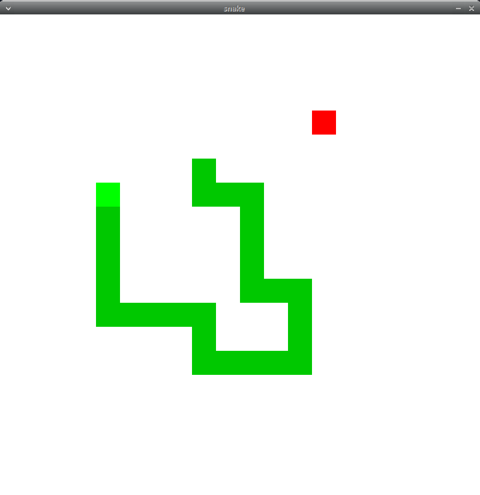
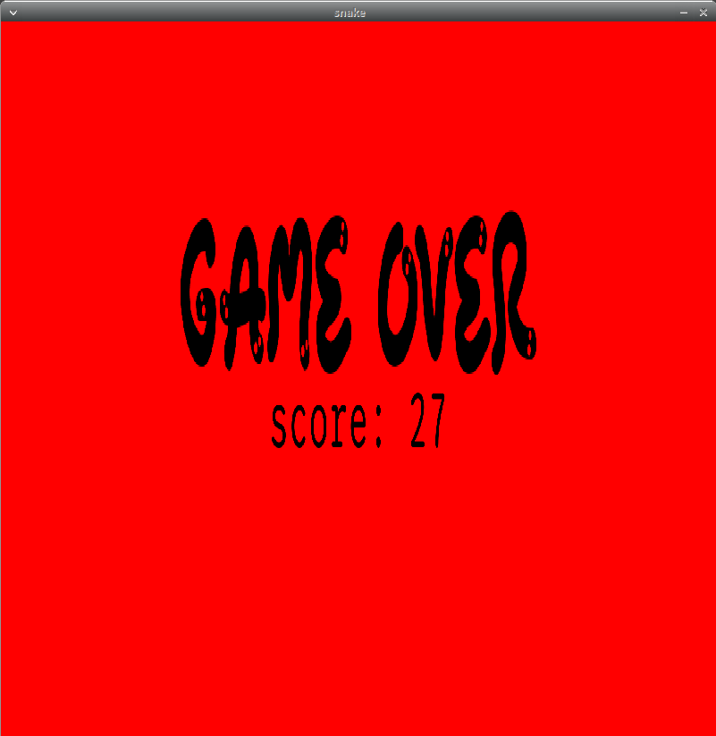

# Snake

This is a Snake game completly written in Rust and the .




<figure class="video_container">
  <iframe src="https://www.youtube.com/embed/Heaoez-ZWxA" frameborder="0" allowfullscreen="true"> </iframe>
</figure>

## How to execute ?

Use **cargo** to build this project with the following commands:
```bash
cargo run --release --features ttf
```

If an error occur, make sure the following packages are installed on the system:
```bash
sudo apt-get install libsdl2-dev libsdl2-ttf-dev
```

## How to play ?

Use the arrow keys to move around the Snake (light green square), in order to eat the apple. When you eat the apple, the Snake length grows by one. If the Snake encounters a border or itself it dies.

**Controls**
* left-arrow key: move left
* right-arrow key: move right
* up-arrow key: move up
* down-arrow key: move down
* escape key: quit the game and close the window
* space key: restart the game
